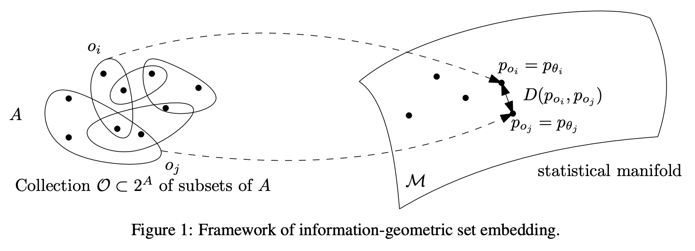

# Information-Geometric Set Embeddings (IGSE): From Sets to Probability Distributions

## 概要
「集合の埋め込み」と呼ばれる抽象的な学習問題の紹介。
この問題の目的は，集合を確率分布に写像することで，より少ない情報を失わないようにすること。集合の和と積の演算を，対応する確率分布の補間と対応させる。

## 集合の埋め込み

ある集合$A$から作成できる部分集合の集合を$2^A$、$2^A$の中のある部分集合(つまり$A$の部分集合のいくつかの集まり)を$\mathcal{O} \subset 2^A$とする。$\mathcal{O}$の要素どうしの関係性を保持した埋め込みを行うために、$\mathcal{O}$の全ての要素をある連続な空間$\mathcal{M}$へ写像することを「集合の埋め込み」という。

- 部分集合の集合は非常に基本的な代数構造である。
- 集合の埋め込みは不均一で離散的な入力に対し、連続一様な表現を与える。
- 埋め込みたいのは$\mathcal{O}$なので、$A$を全て知る必要はない。
- singleton subset : 部分集合の中で、要素が一つのもの？
- 集合を埋め込む写像は、入力の順番に出力が依存しない必要がある。(DeepSets[21]のような特殊なNNで実装可能)

先行研究
- 単語や文の埋め込み [14, 7] (例えば、ベクトル空間演算を用いたword2vec)
  - ↑文は順序付きの多集合とみなす。
  - 部分的に順序づけられた集合の埋め込みに拡張可能[2]
- グラフの埋め込み [18, 9] (例えば、node2vec)
  - グラフは2つのノードの集合である辺の集合とみなす。
  - ハイパーグラフ：エッジが任意個数のノードを連結できる(グラフの一般化)

集合埋め込みでは、これらでは考慮されないことが多い$A$の「メトリック」特性（例えば、部分集合の体積）を考慮できる。可視化にも役立つ。

## 集合の埋め込みの情報幾何

 information-geometric set embedding (IGSE)

埋め込む空間$\mathcal{M}$は統計的多様体[1]と呼ばれ、確率分布の空間内で湾曲した部分空間を表す。したがって集合の埋め込み問題は、$\mathcal{O}$のそれぞれの要素$X\in\mathcal{O}$(つまり$A$の部分集合)に対応する確率分布$p_X\in\mathcal{M}$を見つける問題と言える。

- 統計的多様体はユークリッド空間の一般化。
  - 例えばガウス分布を表す二次元の多様体は$(\mu, \sigma)$で表現できる。
- 集合$X$の濃度$|X|$は、確率分布$p_X$のエントロピー$H(X)$に対応。(どちらもランダムな要素を表現する際の不確実性を測定する)　
  - 例えばHartleyのエントロピーはモロに$H(X)=\log|X|$。
- そもそも集合と確率分布って似てる。
- 集合演算（和集合や積集合）は確率分布の補間にざっくり対応する？
  - 例えば指数分布族$p_A$と$p_B$の中点は、
    - m-中点$c_m$（期待値パラメータ$\eta$の相加平均）
    - e-中点$c_e$（その相加平均が$c_e\propto\sqrt{p_Ap_B}$を満たすようなパラメータ$\theta$）
  - もしくは混合分布$p_{mix}=\frac{p_A+p_B}{2}$（指数分布族じゃなくなるけど。）
  - $support(p_{mix}) ≈ support(A) \cup support(B)$, $support(c_e) ≈ support(A)\cap support(B)$

- IGSEが満たす公理
  - 全ての$X\in\mathcal{O}$について、$p_X \in \mathcal{M}$での$H(p_X)$は$H(U_X)$に対して単調増加。($U_X)$は$A$の部分集合$X$(事象?)に対する一様分布)
  - $\mathcal{O}^2$からのランダムなペア$(X_1,X_2)$について、$D(p_{X_1}:p_{X_2})$と$D(U_{X_1}:U_{X_2})$は相関する？

第1の条件から、IGSEは容量または不確実性の保存を保証する。第2の条件は部分集合の任意のペアの近接性の保存を表す。つまり、大きなオーバーラップを持つ部分集合は近くに埋め込まれ、オーバーラップがほとんどない部分集合は遠くに埋め込まれる。

コンパクトで均一な数値表現を導出するため$\mathcal{M}$を正規分布に制限する。

$\mathcal{O}$が有限の濃度を持つなら、IGSEはヒストグラムの埋め込みとなる。$A_1,A_2,\cdots,A_m\in2^A$として

## 感想

確率分布では、見本空間つまり要素が事象の空間を考えるのかな