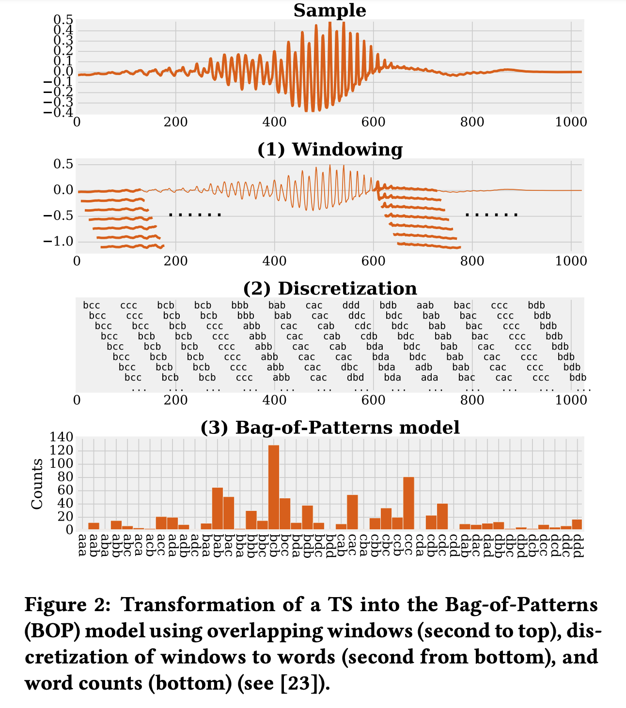

# 概要

多変量時系列（Multivariate Time Series MTS）のクラス分類問題を扱う。 
多変量時系列の難点
- 他の次元との相互作用の存在
- クラス分類に寄与しない次元（ただのノイズ）が存在しうる

WEASEL+MUSEのアプローチの概要は
1. sliding-windowをかけながら、MTS(多変量時系列)から、次元ごと＆窓ごとに離散的な特徴ベクトルを作成する。
2. こうして作成された特徴ベクトルから特徴選択を行い、クラス分類を実行する。

WEASEL+MUSEは離散的な特徴ベクトルとして、文字コードを採用しているのが特徴的。

モーションキャプチャで好成績を収めた。

# 導入
MTSは複数のセンサを備えたシステムから発生する。 
今回はMTSをクラス分類する。（MTSC) 
例えばモーションキャプチャのMTSは、親指の動きなど、クラス分類に追ってどうでも良い次元の系列も存在する。

WEASEL+MUSEは、特徴量選択として、Bag-of-Patterns（BOP）と時系列分類のための単語抽出(WEASEL)をベースとする。 
BOPモデルではMTS上にかけたsliding-windowから特徴量のヒストグラムを作成し、そのヒストグラムを分類器に食わせる。このときの特徴量の抽出方法がSOTAとは異なる。
1. 抽出された各離散特徴に次元（センサ）識別子を付加
2. 精度向上のため、特徴ベクトルにwindow内の微分値を追加。（値のスケールに不変になる）
3. ノイズ低減のためにwindow内の時系列に離散フーリエをかけ、離散化する。
4. 得られた次元ごとの特徴ベクトルを合わせてロジスティック回帰をする。重みの大きい特徴ベクトルがクラス分類に寄与しているはずである。
5. BOPはヒストグラムを用いるので良さそう。
6. WEASEL+MUSEで抽出する特徴量の数は多い（微分値、次元識別子、ユニグラム、バイグラム、様々な窓の長さなど）ので特徴量選択を用いる。

結構いい精度出たけど、[11]のLSTM+FCNには勝てなかったよ...

# BOP
ある次元のTSから、
1. windowで部分系列を切り出し、
2. 離散化し、（つまり文字コードを割り当てる。一文字ではなく文字列。）
3. windowごとに得られる単語（＝文字の並びのパターン）のヒストグラムを作成し、
4. クラス分類器にかける

つまり、

図2

離散化の方法はSAXとSFA
- SAX：平均ベクトルの離散化に基づく？
- SFA：FTの係数の離散化？

# WASEL+MUSE
- 次元間の相互作用：次元同士の複雑な相互作用を考慮している。
- 位相普遍性：クラス分類に寄与するパターンが必ずしも決まった時刻に得られるわけではない。広いレンジを見て、そのパターンを検出したい。
- 無関係な次元や窓：時系列の全ての時間、もしくは全ての次元がクラス分類に寄与しているわけではい。

以上の課題を解決すべく作成する。

## WASEL+MUSEの概要
センサID、windows幅、FT係数を離散化したもの、などを単語にエンコード(c.f. 「2-15-ad,2」は2次元目のwindow幅15の窓をFTした係数の2つ目のユニグラムaaを表す)し、その出現数をカウントする。

より正確には、MTSはまずその次元に分割されます。各次元を一変量TSとみなし、古典的なBOPアプローチを用いて変換します。このために、様々な長さのz正規化された窓が抽出されます。次に、各窓は、各窓の低周波成分のみを保持したまま、切り詰められたフーリエ変換を用いて近似されます。フーリエ値（実部と虚部を別々に）は，記号変換を用いて等深度または等周波数ビニングに基づいて単語に離散化される（詳細は第4.2節で述べる）．これにより、窓の長さを変えた単語（ユニグラム）と単語のペア（ビッググラム）が計算されます。これらの単語は，その識別子であるセンサID（次元）と窓の長さを連結したものである．WEASEL+MUSEは，各次元の単語空間を不連続に保ち，異なる次元からの2つの単語が一致することはありません．無関係な特徴や次元に対処するために，すべての多変量単語に対してカイ二乗検定を適用しています（4.4節）．その結果，非常に識別性の高い特徴ベクトルが得られ，高速な線形時間ロジスティック回帰クラッシャーを訓練することができます（4.4節）．さらに，各次元の重要な特徴に対して高い重みを学習することで，異なる次元の特徴の相互作用を捉えることができる（4.5節）．