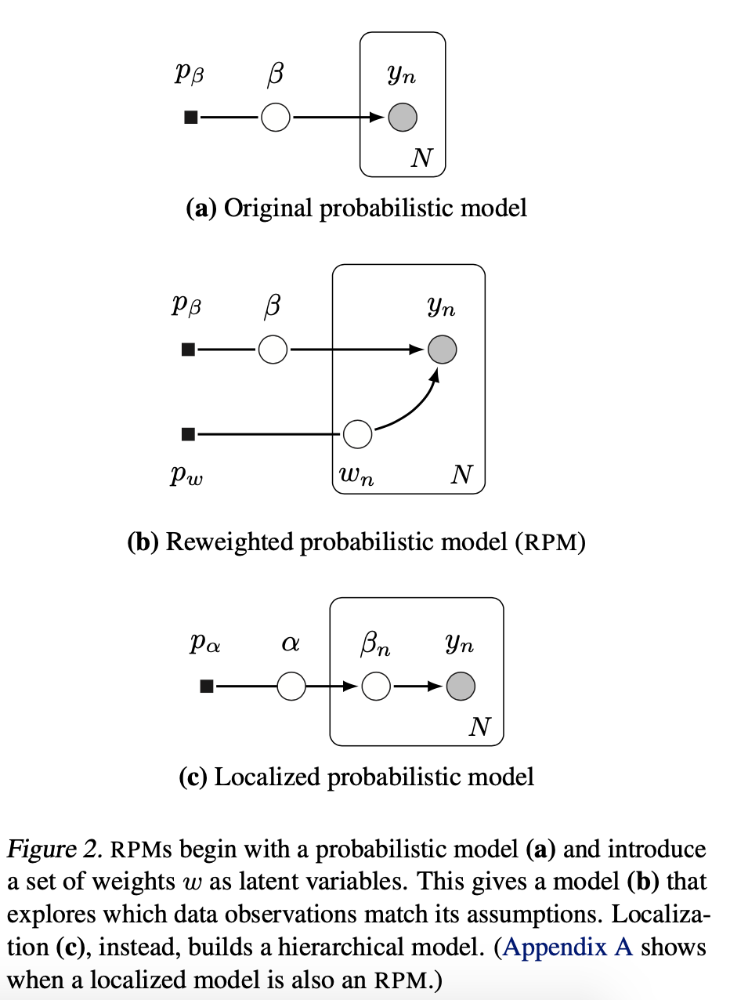
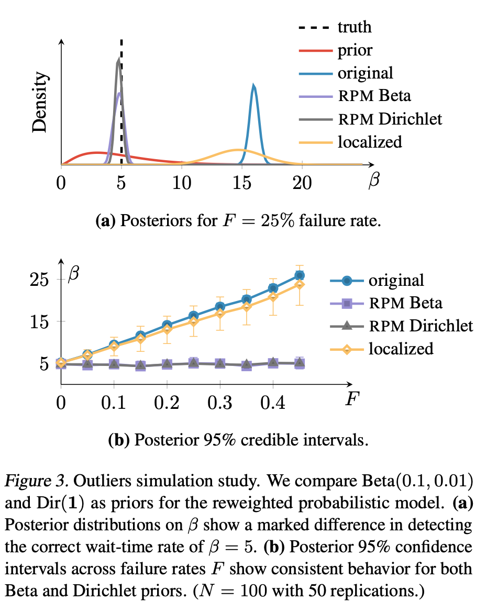
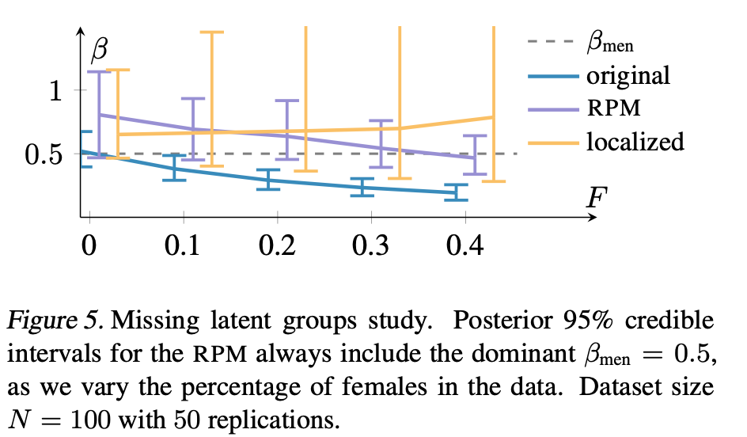

# Robust Probabilistic Modeling with Bayesian Data Reweighting

https://github.com/yixinwang/robust-rpm-public

<!-- 各観測の尤度を重みに上げ、データから潜在変数と重みの両方を推論することである。 -->

本論文では、確率モデルをミスラベルに対して頑健にするためのレシピを示す。

方法：
ガウス尤度をより裾野の重いt分布で置き換える、など。
(これより洗練された確率モデルを我々は使うけどね〜)

### 提案手法概要
reweighted probabilistic models (RPM)(再重み付け確率モデル?)

1. まず確率モデルを作る
2. それぞれの観測データの貢献度を調整する。（それぞれの観測データの尤度を使う？）
3. 元の確率モデルの潜在変数と共にこれらの重みを推論した。

この調整された確率モデルの事後分布は観測がモデルの仮説と整合するかを判断してくれる。

### 定式化
$N$個の独立な観測$y=(y_1,y_2,\dots.y_N)$を考える。尤度関数は観測データごとの尤度の積にできる。
```math
p(y|\beta)=\prod_{n=1}^Nl(y_n|\beta)
```
($y$の尤度＝$y$を観測する確率)

ここで$\beta$は$y$の分布を決める潜在変数。事前確率を$p_{\beta}(\beta)$とする。

Bayesian data reweightingの３ステップについて
1. 確率モデル$p(y,\beta)$を定義
```math
p(y,\beta)=p_{\beta}(\beta)\prod_{n=1}^Nl(y_n|\beta)
```
2. 正の潜在変数$w_n$を使って各観測の尤度を増幅する。同時にその$w=(w_1,w_2,\dots,w_N)$の事前分布$p_w(w)$を選択する。
   ```math
   p(y,\beta,w)=p(w)p(y,\beta|w)\\
   =\frac{1}{Z}p_{\beta}(\beta)p_w(w)\prod_{n=1}^Nl(y_n|\beta)^{w_n}
   ```
   **これがreweighted probabilistic model (RPM)**

3. 潜在変数$\beta$と$w$の事後分布$p(\beta,w|y)$を推定する。


重みwにより、RPMはどの観測がその仮定と一致し(つまり本当に正しいラベルである)、どの観測が一致しない(つまりミスラベル)かを自動的に探索することができる。

ざっくりいうと、事後分布推定はRPMの対数をとった、
```math
\log p_{\beta}(\beta) + \log p_w(w) + \sum_{n=1}^Nw_n\log l(y_n|\beta)\tag{1}
```
こいつを$\beta$と$w$について最大化することである。
ここで$w$の事前分布$p_w(w)$がcorrupted dataを当てるのに重要な役目を果たすので、Section2で三つほど試してみた。


**まず、重み$w$が式(1)に与える影響について。** $w_n$を小さくすると、$w_n\log l(y_n|\beta)$の項は増えるが、$\log w_n$は小さくなる。
$y_n$がcorrupted dataの場合は$\log l(y_n|\beta)$が非常に小さくなるので、$w_n$はより大きい値として推定されます。


**潜在変数$\beta$が式 (1) に与える影響について。** corruptedな観測データの重み$w_n$が小さくなるにつれて、尤度項は、corrupted dataに低質量を割り当て、データセットの残りの部分に焦点を当てることができる。重みと潜在変数が連携して、起こりそうにない測定値を自動的に識別し、元のモデルの仮定に一致する観測に焦点を合わせる。

### Related Work

1. 特定の確率モデルを、不正確な観測に対してより頑健にすることに焦点を当てている研究

2. ロバストベイジアン分析？
   （事前分布の作り方に対する感度分析を行った？）
3. データのreweighting(元々はアンサンブルのためだったけど、各データの重要度信頼度の推定にも使えそう？)

### グラフィカルモデル
<p></p> 


### RPM

尤度$l(\cdot|\beta)$がLesbegue基底測度を持つ指数分布族mに属する時、正規化係数$Z$は$1$に収束する？

ようわからんけど、$w$の事前分布である$p_w(w)$が結果に影響を及ぼすから大事と言っている。なので、ベータ分布、スケーリングされたディリクレ分布、ガンマ分布で事前分布を張って調べてみた。

#### ベータ分布
ここでは$w_n\in(0,1)$としている。それぞれの重みは事前分布では独立同分布に従うとする。
```math
p_w(w)=\prod_{n=1}^NBeta(w_n;a,b)\tag{4}
```
これはRPMにとって最も保守的な選択肢。$w$を考えない元のモデルよりもピークが大きくなることはない。

#### スケーリングされたディリクレ分布
ここでは$w_n$の合計が$N$となるようにしている。
```math
v=\frac{w}{N}\\
p_v(v)=Dirichlet(a{\bold 1})\tag{5}
```
${\bold 1}$は$N\times 1$の$1$が並んだベクトル。$w$を考えない元のモデルでは全ての$w$が$1$であると考えることができる。ハイパラの$a$を小さく設定すれば重み$w$の変更がされやすくなるし、大きくするとディリクレ分布は滑らかになる。(あんま変更されない)

#### ガンマ分布
各重み$w_n$は独立同分布。
```math
p_w(w)=\prod_{n=1}^NGamma(w_n;a,b)\tag{6}
```
$w$の値が無限に大きくなりうるのであんましおすすめしない。

実験からはベータ分布が良さそう、という話になった。

### 理論的なお話
事前分布をガンマ分布としたときの$w_n$のMAP推定量を計算してみると、
```math
\hat w_n=\frac{a-1}{b-\log l(y_n|\beta)}\tag{8}
```
となる。$a>1$の時$\hat w_n$は$l$に対して単調増加。だから$l$が小さい、つまりラベルが怪しいと$\hat w_n$も小さくなり、そのあとの$\beta$の推定に寄与するデータが選別されていく。

後半はようわからんかった...

### 事後分布の推定について
$p(\beta,w|y)$を求めたい。でも簡単に式で描けるような形にはならない。なので、確率的プログラミングシステムStanで自動推論を用いた。

あと次の観測$y_{\dag}$を得る確率分布は$p(y_{\dag}|y)$で表されるが、これが次の$l(\cdot)$となるし、判別問題を解く学習済みのモデルとなるわけである。RPMなら、
```math
p_{RPM}(y_{\dag}|y)=\int\int p(y_{\dag}|\beta,w_{\dag})p(\beta|y)p(w_{\dag})dw_{\dag}d\beta
```

### 実験
人口データと実データ(レコメンドのデータ)でやったよ。

#### ルータがパケットを受け取るまでの時間

が観測できている時、この時間は$Po(\beta)$に従い、$\beta\sim G(a,b)$とする。人口データとして、正しい分布は$\beta=5$とし、でも$F\%$のパケットが失敗して$\beta=50$のポアソン分布にしたがってルータまで届くとしよう。$w_n$の事前分布$G(a=2,b=0.5)$でやった結果が図3。

<p></p> 

ちゃんとRPMでモデル化した奴は$F$が大きくなっても安定してるね！

で、この結果からベータ分布とディリクレ分布そんなに変わらなかったから、我々はベータ分布を採用したんだze。


#### 色盲者の推定
色覚異常の状態と家族歴に関する男女のデータセットがある。性別の情報はないよ。
通常色盲は男性がなりやすいんだけど、そのことを我々は知らないとしよう。

色盲かそうでないかを表す二値ラベル$y_n$は当然ベルヌーイ分布に従う。
```math
y_n\sim Bernoulli(\frac{1}{1+\exp(-p_n)})
```
人口データを作る時、
$p_n$は、$p/n\sim\beta X$でサンプルされる。ただし男性なら$\beta=0.5$、女性なら$\beta=0.01$からサンプルされるようにしておく。ここで$X$が家族歴を表す数値で、$X\sim U(-10,10)$。

この時、男性としてサンプルされたデータ$y_n$が正常ラベル、女性としてサンプルされたデータ$y_n$はミスラベルとする。
```math
p_n=\beta x_n
```
これでデータセット$\{x_n,y_n\}_{n=1}^N$が与えられた時に、しっかりクラス分類できるでしょうか...!?
(ここで$\beta$の事前分布を$\mathcal{N}(0,10)$、$w_n$の事前分布を$Beta(0.1,0.01)$とする。)

同じく$F\%$のサンプルを女性にして人口データを作った結果がこちら。


<p></p> 